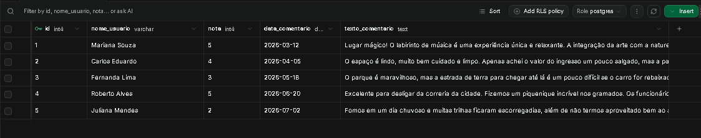

# Desafio DIO: Engenharia de Prompt Aplicada a Dados de Turismo

Este repositório apresenta a solução para o desafio de Engenharia de Prompt, aplicando conceitos de análise de dados no setor de turismo e atrações culturais. O cenário escolhido foi a análise de avaliações de visitantes do **Uaná Etê Cultural Gardens** (Engenheiro Paulo de Frontin - RJ), utilizando uma tabela relacional estruturada em PostgreSQL (hospedada no Supabase).

---

## 📋 1. Intenção da Análise
* **Quero que a IA analise:** Comentários e avaliações de visitantes extraídos de uma tabela SQL para identificar pontos fortes, reclamações sobre a infraestrutura e oportunidades de melhoria na experiência do visitante.
* **O resultado será usado por:** Gestores do parque ecológico e equipes de operação e marketing para apoiar decisões estratégicas e melhorias na experiência ao ar livre.
* **A entrega deve conter:** Um resumo executivo, uma tabela estruturada relacionando temas, sentimentos e ações sugeridas, e as 3 principais prioridades para a gestão do espaço.
* **O resultado será considerado bom se:** For claro, fundamentado exclusivamente nos dados fornecidos e útil para orientar tomadas de decisão reais da administração.

---

## 🗄️ 2. Contexto e Dados Disponíveis
* **Contexto:** Análise de feedbacks de visitantes de um espaço de arte e natureza.
* **Arquitetura de Dados:** A base relacional foi estruturada no **Supabase** (PostgreSQL) utilizando versionamento de migrações (`Flyway`). A tabela `avaliacoes_uan_ete` contém os seguintes campos:
  * `id` (Chave Primária)
  * `nome_usuario` (Nome do avaliador)
  * `nota` (Escala de 1 a 5)
  * `data_comentario` (Data da avaliação)
  * `texto_comentario` (Feedback em texto livre)
* **Critérios de análise:** Classificação por **Tema** (Paisagismo, Infraestrutura, Preço, Atendimento, Clima/Acesso), **Sentimento** (Positivo, Neutro, Negativo) e **Urgência**.
Veja :
---

## 🚀 3. Prompt Final (O Comando para a IA)

```text
Atue como analista de dados e especialista em experiência do visitante no setor de turismo e atrações culturais.

Sua tarefa é analisar a base de avaliações do Uaná Etê Cultural Gardens armazenada na tabela SQL para identificar temas recorrentes, o nível de satisfação dos visitantes e gargalos operacionais.

Contexto: A análise será utilizada pela administração do parque para priorizar melhorias na experiência ao ar livre, corrigir eventuais falhas operacionais e potencializar as qualidades elogiadas pelo público.

Dados disponíveis: Uma tabela SQL relacional contendo o nome do avaliador, nota (1 a 5), data e o texto do comentário.

Instruções de análise:
1. Classifique os comentários por tema, sentimento predominante e urgência de ação.
2. Identifique os principais padrões de elogios e reclamações recorrentes.
3. Apoiando-se estritamente nos dados fornecidos, extraia trechos curtos dos comentários como evidência das análises.
4. Sugira ações práticas e viáveis para a gestão do ponto turístico.

Formato da resposta:
- Resumo Executivo: Até 5 linhas sintetizando o panorama geral das avaliações.
- Tabela de Insights: Colunas contendo [Tema, Sentimento, Evidência em Texto, Ação Sugerida].
- Prioridades Críticas: Uma lista final com as 3 ações mais urgentes recomendadas para o local.

Restrições:
- Use estritamente os dados fornecidos na base.
- Não invente informações ou extrapole além do que os comentários dizem.
- Mantenha a confidencialidade de dados pessoais.
- Use linguagem simples, analítica e voltada para negócios.
